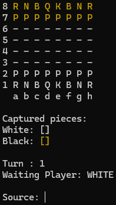

# chess-system

A Java-based chess system designed for learning purposes, allowing you to play chess matches directly in the terminal.  
The project was built without external frameworks to focus on object-oriented programming (OOP), code organization, and the implementation of chess rules.



## How to Run
1. Clone the repository: https://github.com/jrsrezende/chess-system.git
2. Compile the program:
```bash
javac -d out/production/chess-system -cp src src/application/Program.java
```
3. Run the program:
```bash
java -cp out/production/chess-system application.Program
```
4. Follow the instructions in the terminal to start playing