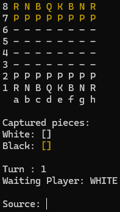

# ♟️ chess-system

## Overview
A Java-based chess system designed for learning purposes, allowing you to play chess matches directly in the terminal.  
The project was built without external frameworks to focus on **object-oriented programming (OOP)**, code organization, and the implementation of chess rules.

## Features
- Terminal-based chessboard with ANSI colors
- Piece movements following official rules
- Move and position validation
- Capturing opponent pieces
- Pawn promotion
- Check and checkmate detection
- Tracking of captured pieces

## Technologies
- Java (no external frameworks)
- ANSI escape codes for terminal coloring

## Requirements
- Java 17+ (or compatible version)
- Terminal/Command Prompt for running the program

## How to Run
1. Clone the repository: https://github.com/jrsrezende/chess-system.git
2. Compile the program: `javac -d out/production/chess-system -cp src src/application/Program.java`
3. Run the program: `java -cp out/production/chess-system application.Program`
4. Follow the instructions in the terminal to start playing

## Project Structure
- `application/`: User interface and entry point of the application
- `BoardGame/`: Generic structures for board games
- `Chess/`: Chess-specific logic, including rules and pieces
- `Chess/pieces/`: Implementation of chess pieces
